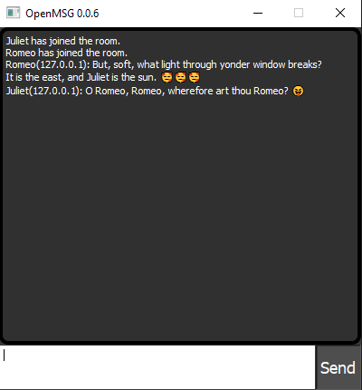

# openmsg
 Open source chat made in Python and PyQt5. Allows hosting, joining and sending messages over network (including commands such as changing nickname). 
 Code is kept as simple as it can be and allows you to customize it to your own needs.
 
 ## Requirements
 ```Python3``` - https://www.python.org 
 
 ```PyQt5``` - https://pypi.org/project/PyQt5/
 
 ## Example
 
 
